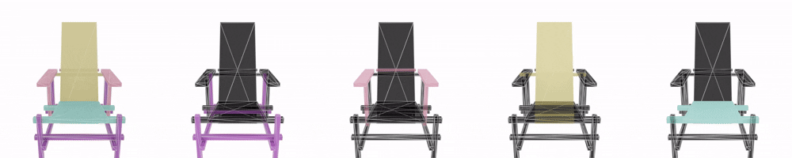

<div align= "center">
    <h1> Official repo for PartMesh</h1>

</div>

<div align="center">
    <h2> PartMesh: Image-to-Mesh with Part Information via Auto-regressive Transformer</h2>
    <h3> Based on <a href="https://arxiv.org/abs/2405.20853">MeshXL: Neural Coordinate Field for Generative 3D Foundation Models</a></h3>


</div>


## 🏃 Intro PartMesh

**PartMesh** is a part-aware 3D mesh generation model that extends MeshXL by incorporating part information into the mesh generation process. By introducing separate tokens between different mesh faces, PartMesh enables the model to understand and generate 3D meshes with distinct part structures. This part-aware representation enhances the model's ability to generate semantically meaningful and structurally coherent 3D objects.

Key innovations of PartMesh include:
- **Part-Aware Representation**: Uses separate tokens to delineate different parts of a 3D mesh
- **Enhanced Structural Coherence**: Generates meshes with more semantically meaningful part structures
- **Improved Control**: Allows for more fine-grained control over the generated 3D objects

## 🎬 Demo Animations

Here are some demonstrations of PartMesh-generated models:

<p align="center">
  
  
</p>

<p align="center">
  
  
</p>

<p align="center">
  
</p>


## ⚡ Quick Start

<details open>
  <summary><b>Environment Setting Up</b></summary>

  You can build the environment using the provided script:
  ```{bashrc}
  bash set_env.sh
  ```

</details>


## 💻 Using PartMesh

<details open>
  <summary><b>More Generated Models</b></summary>

  <p align="center">
    
  </p>

  <p align="center">
    
  </p>

  <p align="center">
    
  </p>

</details>


<details open>
  <summary><b>Using PartMesh - Part-Aware Structure</b></summary>

  <p align="center">
    
    <br>
    <em>Cabinet opening demonstration - showing independent part structure</em>
  </p>

  <p align="center">
    
    <br>
    <em>Another cabinet model demonstrating structural independence of parts</em>
  </p>

  ### Usage

  To generate part-aware 3D meshes with PartMesh, use the following command:

  ```{bashrc}
  bash scripts/sample-partmesh.sh
  ```

  For more control over the generation process:

  ```{bashrc}
  accelerate launch \
    --num_machines 1 \
    --num_processes 1 \
    --mixed_precision bf16 \
    sample_partmesh.py \
    --test_ckpt mesh-xl/partmesh-350m/pytorch_model.bin \
    --image 'path/to/image.jpg' \  # input image path
    --top_k 50 \
    --top_p 0.95 \
    --temperature 0.1
  ```

  ### Implementation Details

  PartMesh introduces the following key modifications to the base architecture:

  1. **Tokenization**: Modified to insert separate tokens between different mesh faces
  2. **Detokenization**: Enhanced to correctly process sequences containing separate tokens
  3. **Model Architecture**: Adapted to understand and generate part-aware mesh representations
  4. **Training Process**: Optimized to learn part boundaries and semantic relationships between parts

  ### Advanced Features

  - **Part-based Editing**: Edit specific parts of a mesh while keeping other parts unchanged
  - **Part Transfer**: Transfer parts between different meshes
  - **Part-based Animation**: Animate specific parts of a mesh independently
  - **Semantic Understanding**: Generate meshes with parts that correspond to semantic concepts

</details>


